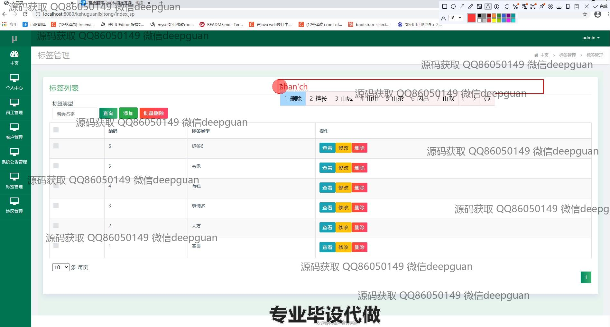
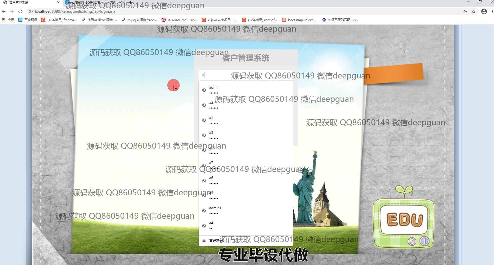

<h1 align="center">基于SSM框架云趣科技客户管理系统</h1>

## 简介
云趣科技客户管理系统：角色包括管理员、用户；主要功能包括客户信息管理、员工管理、考勤管理、系统公告管理、标签管理和地区管理，提供增删改查及报表分析功能，界面简洁直观，便于操作。    --计算机毕业设计源码；毕设源码；java毕业设计源码

## 联系方式

<h3 align="center">获取完整代码与数据库文件 + 微信：deepguan QQ: 86050149 QQ群: 783742310</h3>

<h3 align="center">可帮忙远程部署 包运行成功！提供远程部署、修改代码、设计文档指导、代码讲解等服务！</h3>

## 功能介绍（完整见运行截图）
管理员： 管理员可以访问员工管理、客户管理、系统公告、标签管理和地区管理等模块。功能包括添加、修改和删除员工信息，管理客户资料，发布和编辑系统公告，创建及调整标签，管理地区信息等。管理员能够查看系统中的考勤记录，评估员工的打卡情况并进行相关管理操作。同时，可以通过查询功能快速定位特定信息，管理客户分布和统计报表，以进行数据分析和决策。

用户： 用户可查看个人中心并修改个人信息，包括更改密码和更新联系方式。用户可以在客户管理模块中查看和录入客户信息，如姓名、邮箱、手机号等，并可进行照片上传及备注添加。用户还可使用标签管理进行标签的查看、添加与逻辑删除。系统公告管理中用户可查看公告详情，以及通过搜索功能定向查询特定的公告信息。同时，用户能查询并查看自己的考勤记录。

## 运行截图

本代码来源于网络,仅供学习参考使用!

